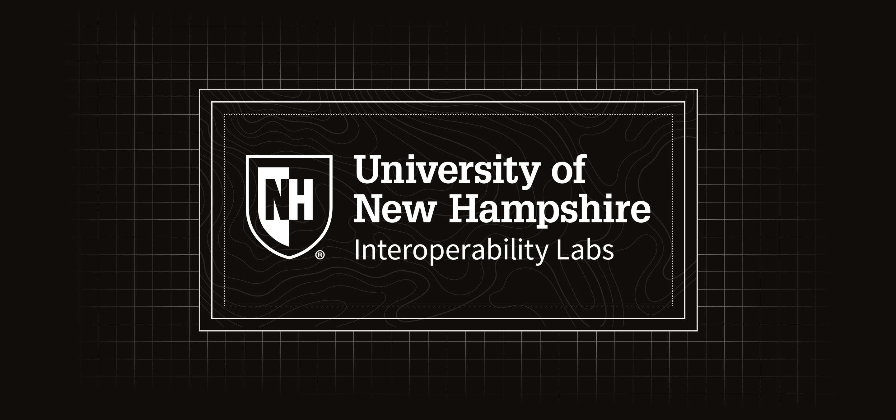

  <h1><a href="https://www.iol.unh.edu/">The UNH Interoperability Labs</a></h1>

  
The [University of New Hampshire Interoperability Labs](https://www.iol.unh.edu/) is the foremost independent testing facility for data networking companies worldwide. Our state-of-the-art laboratory and 36 years of extensive experience make it a strategic resource for industry startups and Fortune 500 companies needing collaboration, innovation, and standards development to help them shape the future of networking.

## 🚀 What We Do
Interoperability & Conformance Testing Independent, vendor‑neutral testing across Ethernet, Blockchain, Automotive, Storage, Broadband, Time‑Sensitive Networking, and more.

Standards Development Support Active participation in IEEE, IETF, OCP, NVMe, and other standards communities.

Research & Innovation Cutting‑edge work in high‑speed networking, embedded systems, automation, and test development.

Workforce Development Hands‑on engineering experience for UNH students, preparing them for careers in networking, silicon design, cybersecurity, and systems engineering.

## 🤝 Collaborate With Us
The UNH‑IOL works with hundreds of companies worldwide — from startups to major silicon vendors. If you're interested in:

- contributing to one of our open‑source projects

- collaborating on standards‑related tooling

- sponsoring a test program

- or exploring research partnerships

we’d love to connect.

🌐 Learn More

	 
	<ul>
    <li>About Our Programs: <a href="https://www.iol.unh.edu/testing">iol.unh.edu/testing</a></li>
    <li>Student Opportunities: <a href="https://www.iol.unh.edu/careers">iol.unh.edu/careers</a></li>
    <li>Contact Us: <a href="https://www.iol.unh.edu/contact">iol.unh.edu/contact</a></li>
  </ul>

  

[Website](https://www.iol.unh.edu/) • [Twitter](https://x.com/UNH_IOL) • [LinkedIn](https://www.linkedin.com/company/unh-interoperability-lab)

